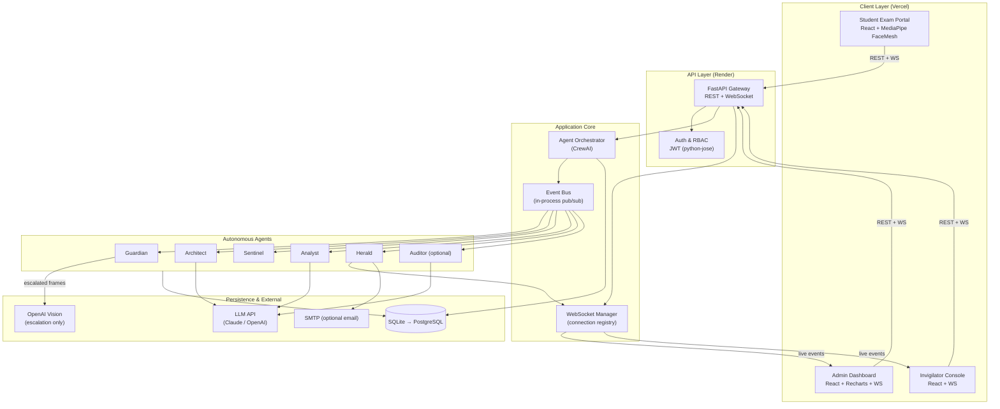
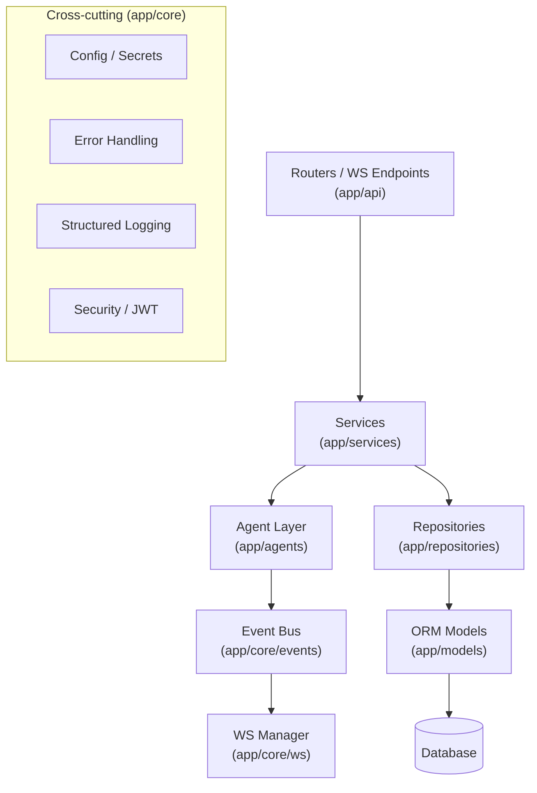
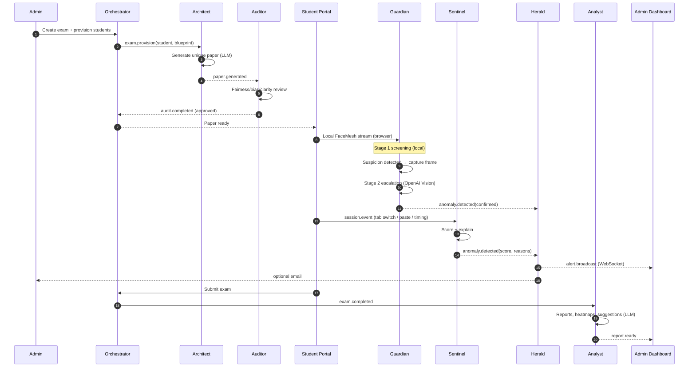
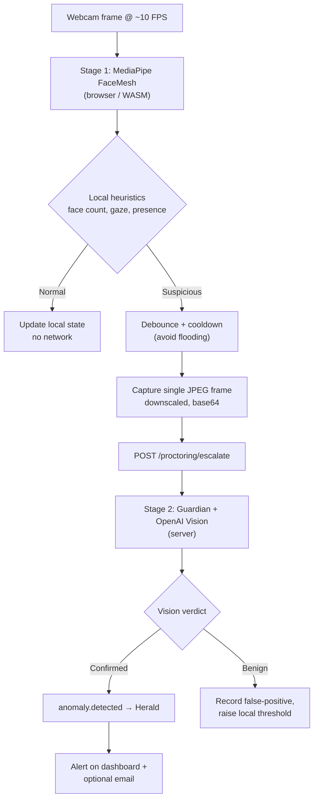
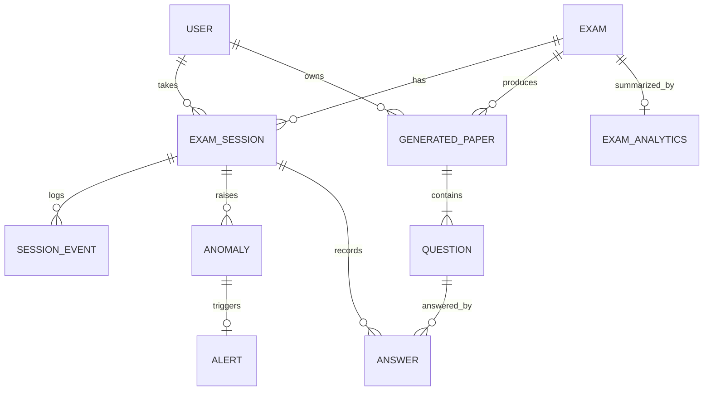
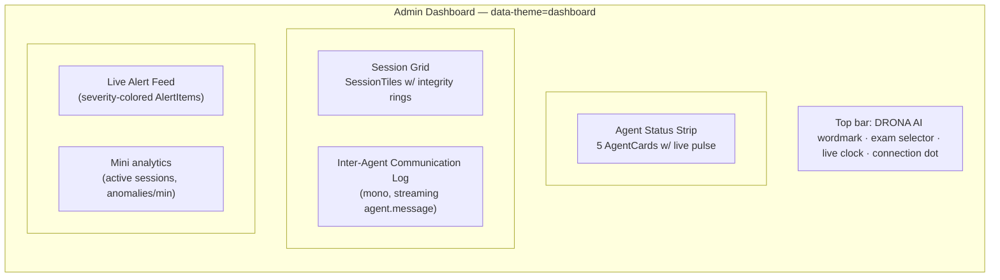

# Design Document: DRONA AI

> **Autonomous Multi-Agent Intelligence System for Examination Integrity**
> Far Away 2026 Hackathon · Theme: Agentic & Autonomous Systems · ~72h build window

---

## Overview

DRONA AI is an autonomous, multi-agent examination integrity platform. Five (optionally six) coordinated AI agents collaborate to make cheating structurally impossible: they generate a unique exam paper for every student, proctor each session live in the browser, detect behavioral fraud with explainable scores, broadcast real-time alerts, and produce post-exam intelligence. Named after Dronacharya — the guru who tested Arjuna with uncompromising precision — the system's signature demo moment is judges watching the agents *talk to each other* and make decisions on a live dashboard.

The architectural centerpiece is a **two-stage proctoring escalation pipeline**. Stage 1 runs entirely in the student's browser using MediaPipe FaceMesh (WebAssembly) — zero server cost, zero latency, fully private. Only when Stage 1 flags a local anomaly (face absent, multiple faces, prolonged gaze-away) does the system escalate a single captured frame to OpenAI Vision (Stage 2) for authoritative confirmation. This keeps cloud spend and latency near zero during normal exams while preserving high-confidence verification exactly when it matters. This document treats that escalation pipeline as a first-class subsystem.

The platform is built as a robust, production-shaped system rather than a demo hack: a layered FastAPI (Python 3.11) backend with async WebSockets, SQLAlchemy over SQLite (local) → PostgreSQL (deploy), JWT role-based auth for three roles (Admin, Invigilator, Student), centralized error handling, and secrets-managed API keys. The frontend is React 18 + Vite + TypeScript + Tailwind, with Recharts analytics and a deliberately designed navy/crimson visual identity. CrewAI orchestrates the agents; deployment targets Render (backend) and Vercel (frontend).

### Design Goals

| Goal | How the design serves it |
|------|--------------------------|
| **Win the demo** | Live agent-to-agent communication feed + real-time anomaly firing on the admin dashboard |
| **Cost & latency efficiency** | Two-stage proctoring: local-first screening, cloud only on escalation |
| **Production robustness** | Layered architecture, typed schemas, RBAC, centralized errors, secrets management |
| **Polished UX** | Concrete design system (color tokens, typography, components) reused across all surfaces |
| **Build speed (72h)** | CrewAI for orchestration, SQLite-first, free-tier deploy, clear P1/P2/P3 phasing |

### The Six Agents at a Glance

| Agent | Role | Priority | Core Tech |
|-------|------|----------|-----------|
| **Guardian** | Face + eye-gaze proctoring | P1 | MediaPipe FaceMesh (browser) + OpenAI Vision (escalation) |
| **Architect** | Unique per-student question generation | P1 | LLM (Claude Sonnet / OpenAI) |
| **Herald** | Real-time alert broadcasting | P1 | WebSocket + optional email (SMTP) |
| **Sentinel** | Behavioral fraud detection with explainability | P2 | Lightweight statistical ML (Python) |
| **Analyst** | Post-exam analytics & reports | P2 | LLM + aggregation + Recharts data |
| **Auditor** *(optional 6th)* | Question fairness audit | P3 | LLM (bias/clarity review) |

---

## Architecture

### System Context



### Layered Backend Architecture

The backend follows a clean, layered architecture so the system stays robust and testable rather than becoming a single-file demo.



**Layer responsibilities:**

- **API layer** (`app/api`): HTTP routers and WebSocket endpoints. Validates input via Pydantic schemas, enforces auth dependencies, returns typed responses. No business logic.
- **Service layer** (`app/services`): Orchestrates use cases (start exam, submit answer, handle anomaly). Coordinates agents, repositories, and the event bus.
- **Agent layer** (`app/agents`): CrewAI agent definitions + tools. Each agent is pure logic over inputs; effects flow through the event bus.
- **Repository layer** (`app/repositories`): All database access. Returns domain models, hides ORM/session details.
- **Core** (`app/core`): Config & secrets, JWT/security, error handlers, logging, the event bus, and the WebSocket connection manager.

### Project Structure

```text
drona-ai/
├── backend/
│   ├── app/
│   │   ├── main.py                 # FastAPI app factory, lifespan, middleware
│   │   ├── core/
│   │   │   ├── config.py           # Pydantic Settings (env-driven secrets)
│   │   │   ├── security.py         # JWT encode/decode, password hashing
│   │   │   ├── errors.py           # Exception types + global handlers
│   │   │   ├── logging.py          # Structured JSON logging
│   │   │   ├── events.py           # In-process async event bus
│   │   │   └── ws.py               # WebSocket connection manager
│   │   ├── api/
│   │   │   ├── deps.py             # Auth/role dependencies
│   │   │   ├── auth.py             # /auth login, refresh
│   │   │   ├── exams.py            # exam + question endpoints
│   │   │   ├── sessions.py         # session lifecycle, events ingest
│   │   │   ├── proctoring.py       # escalation endpoint (Stage 2)
│   │   │   ├── analytics.py        # reports, heatmaps
│   │   │   └── ws_routes.py        # /ws/dashboard, /ws/session
│   │   ├── agents/
│   │   │   ├── orchestrator.py     # CrewAI crew assembly
│   │   │   ├── guardian.py
│   │   │   ├── architect.py
│   │   │   ├── sentinel.py
│   │   │   ├── analyst.py
│   │   │   ├── herald.py
│   │   │   ├── auditor.py          # optional 6th
│   │   │   └── prompts/            # versioned prompt templates
│   │   ├── services/
│   │   ├── repositories/
│   │   ├── models/                 # SQLAlchemy models
│   │   └── schemas/                # Pydantic request/response models
│   ├── tests/
│   ├── alembic/                    # migrations (Postgres)
│   ├── requirements.txt
│   └── render.yaml
└── frontend/
    ├── src/
    │   ├── main.tsx
    │   ├── app/                    # router, providers
    │   ├── theme/                  # design tokens (colors, type)
    │   ├── components/             # shared UI (AgentCard, AlertItem, ...)
    │   ├── features/
    │   │   ├── exam/               # student portal + proctoring hook
    │   │   ├── dashboard/          # admin live dashboard
    │   │   ├── invigilator/
    │   │   └── analytics/          # Recharts views
    │   ├── lib/                    # api client, ws client, mediapipe
    │   └── types/                  # shared TS types (mirror backend schemas)
    ├── tailwind.config.ts
    ├── vite.config.ts
    └── vercel.json
```

---

## Multi-Agent Orchestration

DRONA AI uses **CrewAI** for role-based orchestration. Each agent has a `role`, `goal`, and `backstory` (CrewAI primitives) plus a set of tools. Agents do not call each other directly; they communicate through a shared **event bus**, and every inter-agent message is also streamed to the dashboard as an `agent_message` WebSocket event. This is what makes coordination *visible* — the single most persuasive demo element.

### Agent Roles & Responsibilities

| Agent | Goal | Subscribes to (events) | Emits (events) |
|-------|------|------------------------|----------------|
| **Guardian** | Confirm identity & presence integrity | `frame.escalated` | `anomaly.detected`, `agent.message` |
| **Architect** | Generate a unique, fair paper per student | `exam.provision` | `paper.generated`, `agent.message` |
| **Sentinel** | Detect behavioral fraud patterns | `session.event` | `anomaly.detected`, `agent.message` |
| **Analyst** | Produce post-exam intelligence | `exam.completed` | `report.ready`, `agent.message` |
| **Herald** | Broadcast alerts to humans | `anomaly.detected` | `alert.broadcast`, `agent.message` |
| **Auditor** *(opt)* | Audit question fairness | `paper.generated` | `audit.completed`, `agent.message` |

### End-to-End Orchestration Flow



### Event Bus Contract

A lightweight in-process async pub/sub decouples agents from each other and from transport. It is intentionally simple (fits 72h) but shaped so it could later be swapped for Redis/NATS without touching agents.

```python
# app/core/events.py
from __future__ import annotations
from dataclasses import dataclass, field
from datetime import datetime, timezone
from enum import StrEnum
from typing import Any, Awaitable, Callable
import asyncio, uuid

class EventType(StrEnum):
    EXAM_PROVISION   = "exam.provision"
    PAPER_GENERATED  = "paper.generated"
    AUDIT_COMPLETED  = "audit.completed"
    SESSION_EVENT    = "session.event"
    FRAME_ESCALATED  = "frame.escalated"
    ANOMALY_DETECTED = "anomaly.detected"
    ALERT_BROADCAST  = "alert.broadcast"
    EXAM_COMPLETED   = "exam.completed"
    REPORT_READY     = "report.ready"
    AGENT_MESSAGE    = "agent.message"   # the "agents talking" feed

@dataclass(slots=True)
class Event:
    type: EventType
    payload: dict[str, Any]
    source: str                                  # emitting agent name
    session_id: str | None = None
    id: str = field(default_factory=lambda: str(uuid.uuid4()))
    ts: str = field(default_factory=lambda: datetime.now(timezone.utc).isoformat())

Handler = Callable[[Event], Awaitable[None]]

class EventBus:
    def __init__(self) -> None:
        self._subs: dict[EventType, list[Handler]] = {}

    def subscribe(self, event_type: EventType, handler: Handler) -> None:
        self._subs.setdefault(event_type, []).append(handler)

    async def publish(self, event: Event) -> None:
        # Fan out concurrently; one failing handler must not block others.
        handlers = self._subs.get(event.type, [])
        results = await asyncio.gather(
            *(h(event) for h in handlers), return_exceptions=True
        )
        for r in results:
            if isinstance(r, Exception):
                # logged centrally; never crash the publisher
                log_handler_error(event, r)
```

---

## Two-Stage Proctoring Escalation Pipeline

This is the architectural differentiator: **screen locally, confirm in the cloud only when needed.**

### Rationale

| Concern | Single-stage (cloud every frame) | DRONA two-stage |
|---------|----------------------------------|-----------------|
| Cost | One Vision call per frame × N students × duration → very high | Vision call only on local suspicion → near zero |
| Latency | Network round-trip every frame | Local inference at camera FPS |
| Privacy | Continuous video leaves device | Video stays local; only suspect frames escalate |
| Reliability | Breaks if network degrades | Local screening continues offline; escalation queues |

### Pipeline Stages



### Stage 1 — Local Screening (browser)

Runs in the student portal via MediaPipe FaceMesh in WebAssembly. Produces lightweight signals at ~10 FPS without any network traffic. Heuristics:

- **Face presence**: number of detected faces. `0` → possible absence; `>1` → possible impersonation/help.
- **Gaze direction**: estimated from iris landmarks vs. eye corners. Sustained off-screen gaze beyond a threshold → suspicion.
- **Head pose**: yaw/pitch from key landmarks; prolonged extreme angles → looking away.

Each signal is **debounced** (must persist for a minimum duration) and **rate-limited** (cooldown between escalations) so a brief glance never triggers a cloud call.

### Stage 2 — Cloud Confirmation (server, OpenAI Vision)

Only invoked on a debounced Stage-1 trigger. The browser captures a single downscaled JPEG and POSTs it. The Guardian agent sends it to OpenAI Vision with a tightly scoped prompt asking for a structured verdict (presence, face count, secondary-person, looking-away, confidence). The verdict is authoritative: only a confirmed anomaly becomes an `anomaly.detected` event. Benign verdicts adaptively raise the local threshold to suppress repeat false positives.

> **Security note:** The escalation endpoint requires a valid Student-scoped JWT bound to the active session, validates payload size and MIME, and never persists raw frames longer than needed to produce a verdict (configurable retention; default: discard after scoring, keep only the verdict + thumbnail reference).

---

## Components and Interfaces

### Component: Guardian Agent

**Purpose**: Owns identity & presence integrity through the two-stage pipeline. Stage 1 lives in the browser; the Guardian server component owns Stage 2 confirmation.

**Interface**:
```python
# app/agents/guardian.py
class GuardianAgent:
    async def confirm_escalation(
        self, session_id: str, frame_b64: str, local_signal: "LocalSignal"
    ) -> "VisionVerdict":
        """Stage 2: send frame to OpenAI Vision, return structured verdict."""

    async def on_frame_escalated(self, event: Event) -> None:
        """Event handler: confirm, then emit anomaly.detected if confirmed."""
```

**Responsibilities**:
- Convert a local suspicion + frame into an authoritative verdict via Vision.
- Emit `anomaly.detected` only on confirmation; record false positives otherwise.
- Emit an `agent.message` for the dashboard feed (e.g. "Guardian → Herald: Face absent confirmed in Session #4").

### Component: Architect Agent

**Purpose**: Generate a unique exam paper per student from a blueprint, guaranteeing no two papers are identical.

**Interface**:
```python
class ArchitectAgent:
    async def generate_paper(
        self, blueprint: "ExamBlueprint", student_id: str, seed: str
    ) -> "GeneratedPaper":
        """Produce a unique, fair paper (MCQ / short / numerical)."""
```

**Responsibilities**:
- Build a per-student LLM prompt from the blueprint + a uniqueness seed.
- Parse and validate structured output into typed questions.
- Persist the paper and emit `paper.generated`.

### Component: Sentinel Agent

**Purpose**: Detect behavioral fraud from session telemetry with **explainable** scores.

**Interface**:
```python
class SentinelAgent:
    def score_event(self, session: "SessionState", event: "SessionEvent") -> "AnomalyScore":
        """Return a 0..1 score with human-readable contributing reasons."""

    async def on_session_event(self, event: Event) -> None:
        """Update session state, score, and escalate if over threshold."""
```

**Responsibilities**:
- Track per-session features: tab-switch count, paste events, per-question timing, cross-student answer similarity.
- Produce an explainable score (weighted, with reason breakdown).
- Emit `anomaly.detected` when score crosses threshold.

### Component: Analyst Agent

**Purpose**: Post-exam intelligence — performance reports, difficulty heatmaps, anomaly summaries, AI improvement suggestions.

**Interface**:
```python
class AnalystAgent:
    async def build_report(self, exam_id: str) -> "ExamAnalytics":
        """Aggregate results + LLM narrative; produce dashboard-ready data."""
```

### Component: Herald Agent

**Purpose**: The action arm — broadcast confirmed anomalies to humans in real time.

**Interface**:
```python
class HeraldAgent:
    async def on_anomaly_detected(self, event: Event) -> None:
        """Persist alert, broadcast via WS, optionally email."""

    async def broadcast(self, alert: "Alert") -> None: ...
```

### Component: Auditor Agent *(optional, P3)*

**Purpose**: Review Architect's questions for cultural bias, difficulty calibration, and language clarity before release.

```python
class AuditorAgent:
    async def audit_paper(self, paper: "GeneratedPaper") -> "FairnessAudit": ...
```

### Component: WebSocket Manager

**Purpose**: Maintain live connections per role/room and fan out events.

```python
# app/core/ws.py
class WebSocketManager:
    async def connect(self, ws: WebSocket, room: str, user: "AuthUser") -> None: ...
    def disconnect(self, ws: WebSocket, room: str) -> None: ...
    async def broadcast(self, room: str, message: "WSMessage") -> None: ...
    async def send_personal(self, ws: WebSocket, message: "WSMessage") -> None: ...
```

**Rooms**: `dashboard` (admins), `invigilator:{exam_id}`, `session:{session_id}`.

### Component: Agent Orchestrator

**Purpose**: Assemble the CrewAI crew, wire agents to the event bus, expose service-level entry points.

```python
# app/agents/orchestrator.py
class Orchestrator:
    def build_crew(self) -> "Crew": ...
    def wire_event_bus(self, bus: EventBus) -> None:
        """Subscribe each agent's handlers to its event types."""
    async def provision_exam(self, exam_id: str) -> None: ...
```

---

## Data Models

### Entity-Relationship Overview



### Core Models (SQLAlchemy + Pydantic mirror)

```python
# app/models  (ORM) — Pydantic schemas mirror these in app/schemas
from enum import StrEnum

class Role(StrEnum):
    ADMIN = "admin"
    INVIGILATOR = "invigilator"
    STUDENT = "student"

class User:
    id: str                       # uuid
    email: str                    # unique
    full_name: str
    role: Role
    password_hash: str
    created_at: datetime

class Exam:
    id: str
    title: str
    subject: str
    blueprint: dict               # JSON: topics, counts, difficulty mix, types
    duration_minutes: int
    starts_at: datetime
    status: str                   # draft | provisioning | live | completed
    created_by: str               # User.id (admin)

class Question:
    id: str
    paper_id: str
    index: int
    type: str                     # mcq | short | numerical
    prompt: str
    options: list[str] | None     # for mcq
    answer_key: str               # stored server-side only
    topic: str
    difficulty: float             # 0..1
    max_marks: float

class GeneratedPaper:
    id: str
    exam_id: str
    student_id: str
    seed: str                     # uniqueness seed
    audit_status: str             # pending | approved | flagged
    created_at: datetime

class ExamSession:
    id: str
    exam_id: str
    student_id: str
    paper_id: str
    status: str                   # not_started | active | submitted | terminated
    started_at: datetime | None
    submitted_at: datetime | None
    integrity_score: float        # 1.0 = clean, decreases with anomalies

class SessionEvent:
    id: str
    session_id: str
    kind: str                     # tab_blur | tab_focus | paste | copy |
                                  # answer_change | question_view | heartbeat
    payload: dict
    client_ts: datetime
    server_ts: datetime

class Anomaly:
    id: str
    session_id: str
    source_agent: str             # guardian | sentinel
    category: str                 # face_absent | multiple_faces | gaze_away |
                                  # tab_switch | paste | timing | answer_similarity
    score: float                  # 0..1 severity/confidence
    reasons: list[str]            # explainability breakdown
    evidence: dict                # e.g. vision verdict, frame thumbnail ref
    detected_at: datetime
    confirmed: bool               # passed Stage 2 (for vision-based)

class Alert:
    id: str
    anomaly_id: str
    session_id: str
    severity: str                 # info | warning | danger
    message: str
    delivered_ws: bool
    delivered_email: bool
    created_at: datetime

class Answer:
    id: str
    session_id: str
    question_id: str
    response: str
    time_spent_ms: int
    is_correct: bool | None       # graded post-exam
    awarded_marks: float | None

class ExamAnalytics:
    id: str
    exam_id: str
    summary: dict                 # score distribution, mean, anomalies count
    difficulty_heatmap: dict      # topic/question -> difficulty/accuracy
    per_student: dict             # student_id -> report + suggestions
    generated_at: datetime
```

**Validation rules (enforced in Pydantic schemas):**
- `User.email` unique, RFC-valid; `password` ≥ 8 chars (hashed with bcrypt/argon2, never stored raw).
- `Exam.blueprint` must specify ≥1 topic and total question count ≥1.
- `Question.options` required and length ≥2 when `type == "mcq"`.
- `answer_key` and `Question` for a session are never serialized to the student client.
- `Anomaly.score` and `Alert.severity` constrained to valid ranges/enums.
- `SessionEvent.client_ts` is treated as untrusted; `server_ts` is authoritative for timing analysis.

---

## API Surface (REST)

All endpoints are versioned under `/api/v1`. Auth via `Authorization: Bearer <jwt>`. Roles enforced by FastAPI dependencies (`require_role(...)`).

| Method | Path | Role | Purpose |
|--------|------|------|---------|
| POST | `/auth/login` | public | Email+password → access + refresh tokens |
| POST | `/auth/refresh` | any | Rotate access token |
| GET  | `/auth/me` | any | Current user profile |
| POST | `/exams` | admin | Create exam + blueprint |
| GET  | `/exams` | admin, invigilator | List exams |
| GET  | `/exams/{id}` | admin, invigilator | Exam detail |
| POST | `/exams/{id}/provision` | admin | Trigger Architect to generate papers for enrolled students |
| GET  | `/exams/{id}/papers/status` | admin | Provisioning + audit progress |
| POST | `/sessions/{exam_id}/start` | student | Start session, fetch own paper (no answer keys) |
| GET  | `/sessions/{id}` | student(own), invigilator, admin | Session state |
| POST | `/sessions/{id}/events` | student | Ingest batched session events (Sentinel) |
| POST | `/sessions/{id}/answers` | student | Submit/update an answer |
| POST | `/sessions/{id}/submit` | student | Finalize exam → triggers Analyst |
| POST | `/proctoring/{session_id}/escalate` | student | **Stage 2**: submit suspect frame for Vision confirmation |
| GET  | `/sessions/{id}/anomalies` | invigilator, admin | Anomalies for a session |
| POST | `/sessions/{id}/terminate` | invigilator, admin | Force-end a session |
| GET  | `/analytics/exams/{id}` | admin | Full exam analytics |
| GET  | `/analytics/exams/{id}/report.pdf` | admin | PDF report (P3) |
| GET  | `/agents/status` | admin | Live agent health/status cards |

**Representative request/response (escalation):**

```jsonc
// POST /api/v1/proctoring/{session_id}/escalate
// Request
{
  "local_signal": {
    "kind": "face_absent",          // face_absent | multiple_faces | gaze_away
    "duration_ms": 4200,
    "confidence_local": 0.81
  },
  "frame": "data:image/jpeg;base64,/9j/4AAQ..."  // downscaled single frame
}
// Response
{
  "anomaly_id": "a1b2...",
  "confirmed": true,
  "category": "face_absent",
  "score": 0.93,
  "reasons": ["No face detected in frame", "Consistent with 4.2s local absence"],
  "action": "alert_broadcast"       // or "suppressed" when benign
}
```

---

## WebSocket Event Schema

### Endpoints

- `GET /ws/dashboard` — admins; subscribes to `dashboard` room (all sessions).
- `GET /ws/invigilator/{exam_id}` — invigilators; scoped to one exam.
- `GET /ws/session/{session_id}` — student; receives own session control messages.

Connection requires `?token=<jwt>`; the server validates role and binds the socket to the appropriate room. Heartbeat ping/pong every 20s; stale sockets pruned.

### Message Envelope

```typescript
// Shared by frontend (src/types) and backend (app/schemas)
type WSMessageType =
  | "agent.message"      // inter-agent feed (the demo centerpiece)
  | "agent.status"       // agent health card updates
  | "anomaly.detected"   // new confirmed anomaly
  | "alert.broadcast"    // human-facing alert
  | "session.update"     // session status / integrity score change
  | "report.ready";      // analytics finished

interface WSMessage<T = unknown> {
  type: WSMessageType;
  id: string;            // uuid
  ts: string;            // ISO-8601
  sessionId?: string;
  source: string;        // emitting agent or "orchestrator"
  payload: T;
}
```

### Payload Examples

```jsonc
// agent.message — rendered in the live communication log
{
  "type": "agent.message",
  "source": "Guardian",
  "sessionId": "sess_4",
  "payload": {
    "to": "Herald",
    "text": "Face absent confirmed for 8s in Session #4",
    "level": "danger"
  }
}

// agent.status — drives the 5 agent status cards
{
  "type": "agent.status",
  "source": "Sentinel",
  "payload": { "state": "active", "load": 0.12, "lastActionTs": "2026-06-13T..." }
}

// alert.broadcast — pushes a card into the alert feed
{
  "type": "alert.broadcast",
  "source": "Herald",
  "sessionId": "sess_4",
  "payload": {
    "severity": "danger",
    "message": "Possible impersonation in Session #4 (2 faces)",
    "anomalyId": "a1b2",
    "reasons": ["Vision confirmed 2 faces", "Local multi-face for 6.1s"]
  }
}
```

---

## Design System (Visual Identity)

The visual identity extends the navy/crimson theme from the battle plan into a complete, token-driven system. "DRONA" should feel authoritative, precise, and trustworthy — like an exam authority — while the live dashboard feels alive and high-signal.

### Brand Palette

| Token | Hex | Usage |
|-------|-----|-------|
| `navy-900` | `#11203c` | App shell background (dark dashboard) |
| `navy-800` | `#1b2a4a` | **Primary brand** — hero, headers, primary buttons |
| `navy-600` | `#2f4576` | Gradients, hover states, secondary surfaces |
| `navy-400` | `#5a6ba0` | Muted accents, borders on dark |
| `crimson-600` | `#b3243b` | **Accent brand** — emphasis, active agent, danger CTAs |
| `crimson-400` | `#d65066` | Hover/active for crimson elements |
| `gold-500` | `#c9a227` | "Drona/guru" accent — awards, highlights, sparingly used |

The brand gradient (reused from the battle plan hero) is:
`linear-gradient(135deg, #1b2a4a 0%, #2f4576 60%, #b3243b 140%)`.

### Semantic Tokens

These mirror the tokens already present in the battle plan HTML so the product and the plan share one language.

```css
:root {
  /* Text */
  --color-text-primary:   #1a1d24;
  --color-text-secondary: #5a6270;
  --color-text-tertiary:  #8a93a2;
  --color-text-info:      #1b6ec2;
  --color-text-success:   #1a7f4b;
  --color-text-warning:   #9a6700;
  --color-text-danger:    #c0362c;

  /* Backgrounds */
  --color-bg-primary:   #ffffff;
  --color-bg-secondary: #f4f6f9;
  --color-bg-info:      #e8f1fb;
  --color-bg-success:   #e6f5ec;
  --color-bg-warning:   #fdf4e0;
  --color-bg-danger:    #fce9e7;

  /* Borders */
  --color-border-secondary: #cfd6e0;
  --color-border-tertiary:  #e3e8ee;
  --color-border-info:      #9cc4ec;
  --color-border-warning:   #e9c97a;
  --color-border-danger:    #eaa9a2;

  /* Radii & elevation */
  --radius-md: 8px;
  --radius-lg: 12px;
  --shadow-sm: 0 1px 2px rgba(17,32,60,.06);
  --shadow-md: 0 4px 16px rgba(17,32,60,.10);
}
```

**Dark dashboard surface tokens** (the live admin view runs dark for "mission control" feel):

```css
[data-theme="dashboard"] {
  --surface-0: #11203c;   /* page */
  --surface-1: #182a4a;   /* cards */
  --surface-2: #21365c;   /* raised / hover */
  --on-surface: #e8edf6;
  --on-surface-muted: #9fb0cc;
  --hairline: rgba(255,255,255,.08);
}
```

### Severity → Color Mapping

A single, consistent mapping used across alerts, anomaly badges, agent states, and charts:

| Severity | Text | Background | Border | Meaning |
|----------|------|-----------|--------|---------|
| `info` | `#1b6ec2` | `#e8f1fb` | `#9cc4ec` | Routine agent activity |
| `success` | `#1a7f4b` | `#e6f5ec` | — | Clean session, audit passed |
| `warning` | `#9a6700` | `#fdf4e0` | `#e9c97a` | Low-confidence / soft anomaly |
| `danger` | `#c0362c` | `#fce9e7` | `#eaa9a2` | Confirmed high-severity anomaly |

### Typography

```css
--font-sans: "Inter", -apple-system, "Segoe UI", Roboto, Helvetica, Arial, sans-serif;
--font-mono: "JetBrains Mono", "SFMono-Regular", Menlo, monospace; /* agent log feed */
```

| Style | Size / Weight / Tracking | Use |
|-------|--------------------------|-----|
| Display | 30px / 700 / +0.06em | Hero wordmark "DRONA AI" |
| H1 | 24px / 600 | Page titles |
| H2 | 18px / 600 | Section headers |
| Body | 14px / 400 / 1.5 | Default text |
| Caption | 12px / 500 / +0.06em uppercase | Labels, eyebrows |
| Mono-sm | 12.5px / 400 | Inter-agent communication log |

### Tailwind Token Wiring

```ts
// tailwind.config.ts (excerpt)
export default {
  theme: {
    extend: {
      colors: {
        navy: { 900:"#11203c",800:"#1b2a4a",600:"#2f4576",400:"#5a6ba0" },
        crimson: { 600:"#b3243b",400:"#d65066" },
        gold: { 500:"#c9a227" },
        info:"#1b6ec2", success:"#1a7f4b", warning:"#9a6700", danger:"#c0362c",
      },
      borderRadius: { md:"8px", lg:"12px" },
      boxShadow: {
        sm:"0 1px 2px rgba(17,32,60,.06)",
        md:"0 4px 16px rgba(17,32,60,.10)",
      },
      fontFamily: {
        sans:["Inter","system-ui","sans-serif"],
        mono:["JetBrains Mono","monospace"],
      },
      backgroundImage: {
        "brand-gradient":"linear-gradient(135deg,#1b2a4a 0%,#2f4576 60%,#b3243b 140%)",
      },
    },
  },
} satisfies import("tailwindcss").Config;
```

### Core Component Specs

| Component | Spec |
|-----------|------|
| **Button (primary)** | navy-800 bg, white text, radius-md, shadow-sm; hover navy-600; crimson-600 variant for destructive |
| **AgentCard** | surface-1 card, agent icon in a tinted chip, name + role, live state dot (success=idle, info=working pulse, crimson=alerting), load bar |
| **AlertItem** | left severity bar (severity color), title, reasons list (mono), timestamp, session link; danger items get a subtle crimson glow |
| **AgentMessageRow** | mono font, `Source → Target` in brand colors, message text, ts right-aligned; new rows fade+slide in |
| **SessionTile** | thumbnail/initials, integrity score ring (green→crimson gradient by score), status pill |
| **StatPill** | rounded, semantic bg/text pair from severity mapping |
| **Heatmap cell** | accuracy-driven scale crimson(low)→amber→green(high) |

### Accessibility

- Maintain WCAG AA contrast: navy-800 on white and white on navy-800 both pass; crimson-600 used for text only on light backgrounds (`#fce9e7`/white), not as small text on navy.
- Severity is never encoded by color alone — every alert carries an icon + text label.
- All interactive elements keyboard-focusable with a visible focus ring (`2px` info outline).
- Live regions: the alert feed uses `aria-live="polite"` so screen readers announce new alerts.

> Full WCAG conformance requires manual testing with assistive technologies and expert review; the tokens above are designed to make that achievable, not to certify it.

---

## Live Admin Dashboard (Demo Centerpiece)

The dashboard is the screen judges watch. Layout (dark "mission control" theme):



**What makes it feel alive:**
- Agent cards pulse `info` while working, flash `crimson` when they emit an anomaly.
- The communication log streams `agent.message` events with `Source → Target` styling, e.g. `Guardian → Herald: Face absent confirmed (Session #4)`.
- New alerts slide into the feed with the severity color bar; a soft chime is optional.
- Session tiles' integrity rings shift from green toward crimson as anomalies accrue.

**Frontend WS hook contract:**

```typescript
// src/lib/useDashboardSocket.ts
function useDashboardSocket(token: string): {
  agents: Record<string, AgentStatus>;
  messages: AgentMessage[];      // capped ring buffer (e.g. last 200)
  alerts: Alert[];
  sessions: Record<string, SessionUpdate>;
  connected: boolean;
};
```

---

## Low-Level Design: Key Functions & Algorithms

### Stage 1 — Local Gaze/Presence Screening (browser)

```typescript
// frontend/src/features/exam/proctoring.ts
interface LocalSignal {
  kind: "face_absent" | "multiple_faces" | "gaze_away" | "none";
  durationMs: number;
  confidenceLocal: number;   // 0..1
}

interface ProctorState {
  consecutive: Record<string, number>;  // ms accumulated per signal kind
  lastEscalationTs: Record<string, number>;
}

/**
 * Evaluate one FaceMesh result. Pure function over current frame + state.
 * Preconditions:  faceCount >= 0; gazeOffset in [0,1]; now is monotonic ms.
 * Postconditions: returns a debounced signal; mutates state's accumulators;
 *                 returns kind "none" unless a threshold+cooldown is satisfied.
 */
function evaluateFrame(
  faceCount: number,
  gazeOffset: number,        // 0 = centered, 1 = fully off-screen
  headYawDeg: number,
  now: number,
  state: ProctorState,
  cfg: ProctorConfig
): LocalSignal;
```

```pascal
ALGORITHM evaluateFrame(faceCount, gazeOffset, headYaw, now, state, cfg)
BEGIN
  // 1. Classify the instantaneous condition
  IF faceCount = 0 THEN candidate ← "face_absent"
  ELSE IF faceCount > 1 THEN candidate ← "multiple_faces"
  ELSE IF gazeOffset > cfg.gazeThreshold OR |headYaw| > cfg.yawThreshold
       THEN candidate ← "gaze_away"
  ELSE candidate ← "none"

  // 2. Accumulate / reset debounce timers
  FOR each kind IN state.consecutive DO
    IF kind = candidate THEN state.consecutive[kind] += cfg.frameIntervalMs
    ELSE state.consecutive[kind] ← 0
  END FOR

  IF candidate = "none" THEN RETURN { kind:"none", durationMs:0, confidenceLocal:0 }

  // 3. Require persistence beyond minDurationMs
  dur ← state.consecutive[candidate]
  IF dur < cfg.minDurationMs[candidate] THEN
    RETURN { kind:"none", durationMs:dur, confidenceLocal:0 }

  // 4. Enforce cooldown to avoid flooding the escalation endpoint
  IF now - state.lastEscalationTs[candidate] < cfg.cooldownMs THEN
    RETURN { kind:"none", durationMs:dur, confidenceLocal:0 }

  state.lastEscalationTs[candidate] ← now
  RETURN { kind:candidate, durationMs:dur,
           confidenceLocal: clamp(dur / cfg.minDurationMs[candidate], 0, 1) }
END
```

**Loop invariant** (step 2): after processing, exactly one accumulator (the active candidate's) is non-decreasing for a sustained condition; all others are reset to 0. This guarantees a single signal kind can satisfy the threshold at a time.

### Stage 2 — Guardian Vision Confirmation (server)

```python
# app/agents/guardian.py
async def confirm_escalation(
    self, session_id: str, frame_b64: str, local: LocalSignal
) -> VisionVerdict:
    """
    Preconditions:
      - session_id refers to an ACTIVE session owned by the caller (JWT-bound).
      - frame_b64 is a valid, size-bounded JPEG data URL.
    Postconditions:
      - Returns a structured verdict with confidence in [0,1].
      - Performs exactly one Vision call (no retries that duplicate billing
        beyond the configured max_retries with backoff).
      - Raw frame is not persisted beyond scoring (retention policy default).
    """
    validate_frame(frame_b64, max_bytes=self.cfg.max_frame_bytes)   # raises on bad input
    verdict = await self._vision_client.classify(
        image=frame_b64,
        prompt=GUARDIAN_VISION_PROMPT,
        response_schema=VISION_VERDICT_SCHEMA,    # structured/JSON mode
        timeout=self.cfg.vision_timeout_s,
    )
    return VisionVerdict.model_validate(verdict)
```

```python
class VisionVerdict(BaseModel):
    present: bool
    face_count: int
    secondary_person: bool
    looking_away: bool
    confidence: float = Field(ge=0, le=1)
    rationale: str
```

### Sentinel — Explainable Behavioral Scoring

The score is a transparent weighted sum of normalized features; each contributing term becomes a human-readable reason. No black box — this is the "explainability score" the plan calls for.

```python
# app/agents/sentinel.py
WEIGHTS = {
    "tab_switch_rate":     0.25,
    "paste_events":        0.30,
    "timing_anomaly":      0.20,
    "answer_similarity":   0.25,
}

def score_event(self, s: SessionState, e: SessionEvent) -> AnomalyScore:
    """
    Preconditions:  s aggregates prior events for this session; e is the new event.
    Postconditions: returns score in [0,1] and reasons explaining every term
                    whose normalized contribution exceeds cfg.reason_threshold.
                    Function is pure w.r.t. s (returns updated features, no I/O).
    """
    f = update_features(s.features, e)            # incremental, O(1) per event
    terms = {
        "tab_switch_rate":   norm(f.tab_switches / max(f.minutes, 1), cap=6),
        "paste_events":      norm(f.paste_count, cap=3),
        "timing_anomaly":    timing_z_score(f),   # |z| over expected per-Q time
        "answer_similarity": f.max_similarity,    # cross-student cosine, 0..1
    }
    score = sum(WEIGHTS[k] * v for k, v in terms.items())
    reasons = [explain(k, v) for k, v in terms.items()
               if v >= self.cfg.reason_threshold]
    return AnomalyScore(value=clamp(score, 0, 1), reasons=reasons, features=f)
```

```pascal
ALGORITHM timing_z_score(features)
// Flags answers submitted impossibly fast or with abnormal uniformity.
BEGIN
  expected ← features.expectedTimePerQuestion      // calibrated from blueprint
  observed ← features.lastQuestionTimeMs
  sigma    ← max(features.timeStdDev, MIN_SIGMA)    // guard divide-by-zero
  z        ← (expected - observed) / sigma          // positive = suspiciously fast
  RETURN clamp(z / Z_CAP, 0, 1)
END
```

**Answer-similarity** is computed by the orchestrator across concurrent sessions: answers are vectorized (TF-IDF for text, exact-match vector for MCQ); pairwise cosine similarity above a threshold contributes to both sessions' `answer_similarity` feature. Complexity is bounded by batching comparisons per question rather than all-pairwise on every event.

### Architect — Unique Paper Generation

```python
# app/agents/architect.py
async def generate_paper(
    self, blueprint: ExamBlueprint, student_id: str, seed: str
) -> GeneratedPaper:
    """
    Preconditions:  blueprint has >=1 topic and total_count >= 1.
    Postconditions: returns a paper with exactly blueprint.total_count questions,
                    each validated by type; (student_id, seed) makes it unique;
                    answer keys stored server-side only.
    """
    prompt = build_architect_prompt(blueprint, seed)
    raw = await self._llm.complete(prompt, response_schema=PAPER_SCHEMA, temperature=0.9)
    paper = parse_and_validate(raw, blueprint)     # raises if counts/types mismatch
    await self._repo.save_paper(paper, exam_id=blueprint.exam_id, student_id=student_id)
    await self._bus.publish(Event(EventType.PAPER_GENERATED, {...}, source="Architect"))
    return paper
```

**Uniqueness guarantee**: the `seed` (hash of `exam_id + student_id + nonce`) is injected into the prompt and `temperature=0.9` diversifies surface form, while the blueprint pins topic/difficulty distribution so papers stay *equivalent in fairness* but *distinct in content*. A post-generation similarity check against already-issued papers for the same exam can trigger regeneration if cosine similarity exceeds a ceiling.

---

## Prompt Structures

### Architect Prompt (question generation)

```text
SYSTEM:
You are the Architect agent in DRONA AI. Generate a fair, original exam paper.
Return ONLY JSON matching the provided schema. Never repeat well-known textbook
items verbatim. Calibrate difficulty to the blueprint distribution.

USER (templated):
Exam subject: {subject}
Blueprint:
  - Topics & counts: {topic_counts}
  - Difficulty mix: {difficulty_mix}   # e.g. easy 30% / medium 50% / hard 20%
  - Question types: {types}            # mcq | short | numerical
Uniqueness seed: {seed}                # diversify wording & values; keep fairness
Constraints:
  - MCQ: exactly 4 options, one correct, plausible distractors.
  - Numerical: include units and a precise numeric answer_key.
  - Avoid cultural/regional bias; use clear, exam-appropriate language.
Output JSON schema: {PAPER_SCHEMA}
```

### Analyst Prompt (post-exam intelligence)

```text
SYSTEM:
You are the Analyst agent in DRONA AI. Produce concise, actionable, fair
post-exam intelligence. Be specific and evidence-based; no fabricated numbers.

USER (templated):
Exam: {title} ({subject})
Aggregate stats: {score_distribution}, mean={mean}, median={median}
Per-question accuracy: {question_accuracy}
Anomaly summary: {anomaly_counts_by_category}
For each student in {student_results}, produce:
  - performance_summary (2-3 sentences)
  - top_strengths (topics), top_gaps (topics)
  - improvement_suggestions (3 concrete, prioritized actions)
Also produce a difficulty_heatmap: per topic -> {accuracy, avg_time, difficulty}.
Output JSON schema: {ANALYTICS_SCHEMA}
```

### Guardian Vision Prompt (Stage 2)

```text
SYSTEM:
You are the Guardian agent's vision verifier for an online exam. Given a single
webcam frame, determine presence and integrity. Respond ONLY in the JSON schema.

USER:
Local screening flagged: {local_signal.kind} for {local_signal.duration_ms} ms.
Assess the frame and report:
  present (bool), face_count (int), secondary_person (bool),
  looking_away (bool), confidence (0..1), rationale (short).
Do not guess identity. Judge only presence, count, and gaze direction.
Output JSON schema: {VISION_VERDICT_SCHEMA}
```

### Auditor Prompt (optional, fairness)

```text
SYSTEM:
You are the Auditor agent. Review exam questions for cultural bias, difficulty
miscalibration, and language ambiguity. Be conservative; flag only real issues.

USER:
Questions: {questions}
For each, return: {question_id, bias_flag, clarity_flag, difficulty_estimate,
suggested_fix?}. Provide an overall verdict: approved | needs_revision.
Output JSON schema: {AUDIT_SCHEMA}
```

---

## Correctness Properties

These are universal statements the implementation must uphold; they double as the basis for property-based tests.

1. **Escalation gating**: For all frame sequences, a Vision (Stage 2) call occurs only after a Stage-1 signal has persisted ≥ `minDurationMs` and the cooldown since the last escalation of that kind has elapsed.
   `∀ frames: vision_call ⟹ (signal.durationMs ≥ minDurationMs[kind] ∧ now − lastEscalation[kind] ≥ cooldownMs)`

2. **No false alerts without confirmation**: For all vision-sourced anomalies, `anomaly.confirmed == true` before Herald broadcasts.
   `∀ a where a.source == "guardian": broadcast(a) ⟹ a.confirmed`

3. **Score bounds & monotonic reasons**: For all events, `0 ≤ score ≤ 1`, and every reason returned corresponds to a term whose normalized contribution ≥ `reason_threshold`.

4. **Paper uniqueness**: For all pairs of papers in the same exam, content similarity < `uniqueness_ceiling`, while topic/difficulty distribution matches the blueprint.
   `∀ p1,p2 ∈ exam, p1≠p2: similarity(p1,p2) < ceiling ∧ distribution(p1)=distribution(p2)=blueprint`

5. **Answer-key confidentiality**: For all student-facing responses, no `answer_key` field is ever serialized.
   `∀ resp to student: "answer_key" ∉ resp`

6. **RBAC enforcement**: For all protected endpoints, a request without the required role is rejected with 403 before any business logic runs.

7. **Event delivery idempotency**: For all events, replaying the same `event.id` does not create duplicate anomalies/alerts (dedup by id).

8. **Integrity score monotonicity**: For all sessions, `integrity_score` is non-increasing as confirmed anomalies accumulate.

**Property-Based Testing Library**: `hypothesis` (Python, backend) and `fast-check` (TypeScript, frontend Stage-1 logic).

---

## Error Handling

| Scenario | Condition | Response | Recovery |
|----------|-----------|----------|----------|
| LLM failure/timeout | Architect/Analyst LLM call errors or times out | Retry with capped exponential backoff (max N); on exhaustion emit `agent.status=degraded` | Architect: queue student for re-provision; Analyst: serve partial report + retry job |
| Vision failure | OpenAI Vision unavailable on escalation | Record anomaly as `confirmed=false, category=...,_unverified`; surface as `warning` not `danger` | Invigilator can manually confirm; auto-retry once |
| Invalid frame | Oversized/malformed escalation payload | 422 with error code; no Vision call | Client downscales and may retry within cooldown |
| WebSocket drop | Client disconnects / network blip | Prune socket; client auto-reconnects with backoff and resyncs via REST snapshot | No event loss for persisted data (DB is source of truth) |
| DB transient error | Connection/timeout | Repository retries once; otherwise 503 with request id | Idempotent writes safe to retry |
| Auth failure | Invalid/expired JWT | 401 (expired) / 403 (wrong role) with machine-readable code | Client refreshes token or re-logs in |
| Duplicate event | Same `event.id` replayed | Dedup, no-op | Logged at debug |

**Centralized handling**: custom exception hierarchy (`AppError` → `AuthError`, `NotFoundError`, `ValidationError`, `UpstreamError`) mapped by a global FastAPI exception handler to a consistent error envelope:

```jsonc
{ "error": { "code": "UPSTREAM_VISION_TIMEOUT", "message": "…", "requestId": "…" } }
```

All errors are logged with a correlation/request id (structured JSON logs). Agent handlers never crash the event bus — exceptions are captured and reported as `agent.status=degraded`.

---

## Backend Robustness & Security

This section addresses the "robust, production-quality backend" requirement.

### Configuration & Secrets

```python
# app/core/config.py
class Settings(BaseSettings):
    environment: str = "development"
    database_url: str                       # sqlite:///./drona.db | postgres://...
    jwt_secret: SecretStr                    # never logged
    jwt_access_ttl_min: int = 15
    jwt_refresh_ttl_days: int = 7
    anthropic_api_key: SecretStr | None = None
    openai_api_key: SecretStr | None = None  # vision + optional LLM
    smtp_url: SecretStr | None = None        # optional Herald email
    vision_timeout_s: float = 8.0
    max_frame_bytes: int = 400_000
    model_config = SettingsConfigDict(env_file=".env", extra="ignore")
```

- All secrets come from environment / Render secret files — never committed. `.env.example` documents keys without values.
- `SecretStr` prevents accidental logging.

### Auth & RBAC

- JWT (access + refresh) via `python-jose`; passwords hashed with `passlib[bcrypt]`.
- FastAPI dependency `require_role(*roles)` guards routers; WebSocket connections validate token and role before joining a room.
- Students can only access their own session/paper (ownership check in service layer).

### Hardening

- CORS locked to the Vercel frontend origin(s).
- Rate limiting on `/auth/login` and `/proctoring/escalate` (per-IP + per-session) to bound cost/abuse.
- Pydantic validation on every input; payload size limits on the escalation endpoint.
- SQLAlchemy parameterized queries only (no string SQL) — prevents injection.
- Security headers middleware; HTTPS enforced at the platform edge.
- Frames are processed in-memory and discarded post-scoring by default (configurable retention).

> **Security callout**: The escalation endpoint and all WebSocket endpoints are authenticated and role-scoped by design. No network-exposed endpoint is left unauthenticated; this is explicitly enforced in `app/api/deps.py`.

---

## Testing Strategy

### Unit Testing
- **Stage-1 logic** (`evaluateFrame`): table-driven tests for debounce, cooldown, and signal classification (Vitest).
- **Sentinel scoring**: deterministic feature→score→reasons mapping; boundary cases at thresholds (pytest).
- **Architect/Analyst parsing**: validate LLM output parsing against schema, including malformed-output handling (mocked LLM).
- **RBAC dependencies**: each role × each endpoint returns expected 200/403.

### Property-Based Testing
- `fast-check`: property 1 (escalation gating) and the loop invariant of `evaluateFrame` over random frame streams.
- `hypothesis`: property 3 (score bounds), property 5 (answer-key never serialized), property 8 (integrity monotonicity) over random event sequences.

### Integration Testing
- Full loop test (mirrors Day-2 plan): start exam → emit session events → trigger escalation (mocked Vision) → assert `anomaly.detected` → assert Herald broadcast over a test WebSocket client → submit → assert Analyst `report.ready`.
- WebSocket auth: connecting with wrong role is rejected.

### Demo-data Seeding
- A seed script provisions an admin, an invigilator, several students, one exam with a small blueprint, and a scripted anomaly timeline so the live demo is reliable and repeatable.

---

## Performance Considerations

- **Two-stage pipeline** is the primary performance/cost lever: Stage 1 at ~10 FPS locally; Stage 2 only on debounced suspicion → Vision calls scale with *anomalies*, not *frames × students*.
- **Event ingestion** is batched (`POST /sessions/{id}/events` accepts arrays) to reduce request overhead during exams.
- **WebSocket fan-out** uses a per-room registry; the agent-message feed is a capped ring buffer client-side (last ~200) to keep the DOM light.
- **Answer-similarity** comparisons are batched per question rather than recomputed pairwise on every event.
- **DB**: indices on `session_id`, `exam_id`, `(exam_id, student_id)`; SQLite for local/dev, PostgreSQL (with a small connection pool) for deploy.
- LLM calls (Architect provisioning) run as background tasks so the request thread is never blocked.

---

## Dependencies

### Backend (`requirements.txt`)
- `fastapi`, `uvicorn[standard]` — async API + WebSockets
- `sqlalchemy`, `alembic` — ORM + migrations
- `psycopg[binary]` — PostgreSQL driver (deploy)
- `pydantic`, `pydantic-settings` — schemas + config
- `python-jose[cryptography]`, `passlib[bcrypt]` — JWT + hashing
- `crewai` — multi-agent orchestration
- `anthropic` and/or `openai` — LLM + Vision
- `httpx` — async HTTP for upstreams
- `pytest`, `hypothesis`, `pytest-asyncio` — testing
- `reportlab` *(P3)* — PDF reports

### Frontend (`package.json`)
- `react`, `react-dom` (18), `vite`, `typescript`
- `tailwindcss`, `postcss`, `autoprefixer`
- `@mediapipe/tasks-vision` — FaceMesh in browser
- `recharts` — analytics charts
- `react-router-dom` — routing
- `zustand` or React Context — lightweight state for live socket data
- `vitest`, `fast-check`, `@testing-library/react` — testing

### Platform
- **Render** — backend web service (auto-deploy from GitHub; `render.yaml`); managed PostgreSQL.
- **Vercel** — frontend (instant deploy, free HTTPS); `vercel.json` rewrites for SPA.

---

## Build Phasing (maps to the 72h plan)

| Phase | Scope | Agents/Features |
|-------|-------|-----------------|
| **P1 — qualify** | Orchestration backbone, Guardian (Stage 1 + escalation), Architect, student portal, admin dashboard, Herald | Day 1–2 |
| **P2 — top 100** | Sentinel, agent communication visualization, Analyst, RBAC | Day 2–3 |
| **P3 — bonus** | Auditor (fairness), PDF reports, voice accessibility | If time remains |

> The two-stage escalation pipeline is intentionally inside P1 (Guardian) because it is both the cost optimization and a standout technical talking point for judges.

---

## Open Questions / Assumptions

- **LLM provider**: Battle plan names Claude Sonnet; the user's refinement specifies OpenAI Vision for Stage 2. Design assumes **Claude for text generation (Architect/Analyst/Auditor)** and **OpenAI Vision for Stage-2 confirmation**, with provider selection abstracted behind a client interface so either can serve text if needed.
- **Email delivery** (Herald) is optional and behind `smtp_url`; WebSocket broadcast is the primary, always-on channel.
- **Frame retention** defaults to discard-after-scoring; if judges want an evidence trail, a thumbnail-only retention mode is available via config.
- Persisted DB is the source of truth; WebSocket is a live projection, so reconnects resync without data loss.
