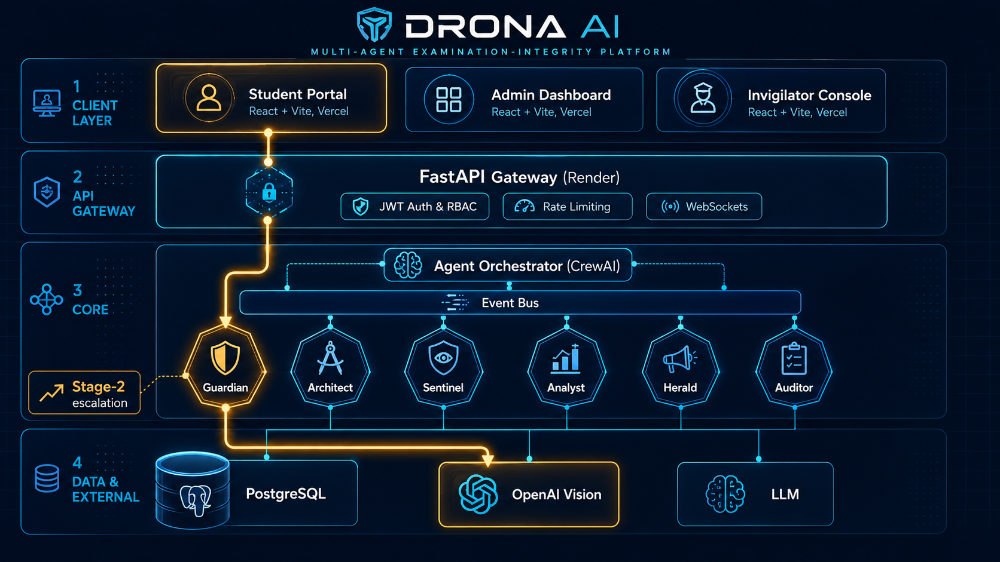
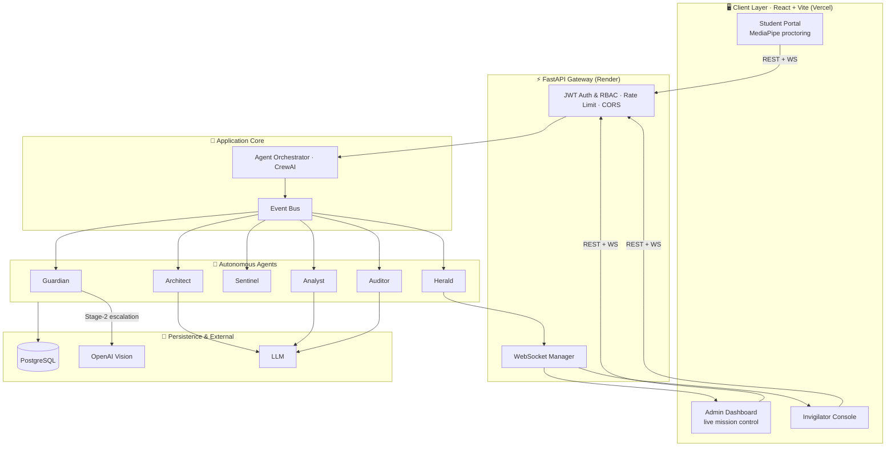
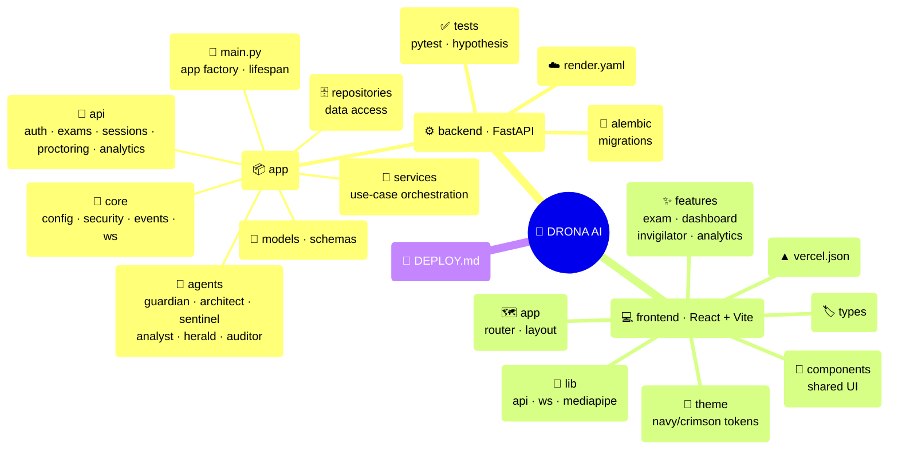

# DRONA AI

> **Autonomous Multi-Agent Intelligence for Examination Integrity**
> Far Away 2026 Hackathon · Theme: Agentic & Autonomous Systems

DRONA AI deploys a crew of coordinated autonomous agents that make exam cheating
structurally difficult: they generate a unique paper for every student, proctor
each session live in the browser, detect behavioral fraud with **explainable**
scores, broadcast real-time alerts, and produce post-exam intelligence. Named
after Dronacharya — the guru who tested Arjuna with uncompromising precision —
the system's signature moment is watching the agents *talk to each other* on a
live mission-control dashboard.

The architectural centerpiece is a **two-stage proctoring pipeline**: Stage 1
screens locally in the browser with MediaPipe FaceMesh at zero network cost, and
Stage 2 escalates a single captured frame to OpenAI Vision for authoritative
confirmation **only when a local anomaly is first detected** — keeping cloud
cost and latency near zero during normal exams.

---

## The Agents

| Agent | Role |
|-------|------|
| **Guardian** | Face + eye-gaze proctoring (local MediaPipe → OpenAI Vision on escalation) |
| **Architect** | Generates a unique, equivalently-fair exam paper per student |
| **Sentinel** | Detects behavioral fraud (tab-switching, paste, timing, answer similarity) with explainable scores |
| **Analyst** | Post-exam analytics: score distributions, difficulty heatmaps, per-student suggestions |
| **Herald** | Broadcasts confirmed anomalies in real time over WebSocket (+ optional email) |
| **Auditor** *(optional)* | Reviews generated questions for cultural bias, difficulty calibration, and clarity |

Agents are decoupled through an in-process event bus and coordinated by a CrewAI
orchestrator. Every inter-agent message is streamed to the admin dashboard.

---

## Tech Stack

**Backend** — Python 3.11 · FastAPI · async WebSockets · SQLAlchemy
(SQLite local → PostgreSQL deploy) · Alembic · JWT (python-jose) + bcrypt ·
CrewAI · OpenAI / Anthropic · `hypothesis` (property-based tests)

**Frontend** — React 18 · Vite · TypeScript · Tailwind CSS · Recharts ·
`@mediapipe/tasks-vision` · `fast-check` (property-based tests)

**Deploy** — Render (backend + managed PostgreSQL) · Vercel (frontend)

---

## Architecture





### Two-Stage Proctoring

```
Webcam @ ~10 FPS → MediaPipe FaceMesh (browser, Stage 1)
   ├─ normal      → update local state, NO network
   └─ suspicious  → debounce + cooldown → capture 1 JPEG
                     → POST /proctoring/{id}/escalate
                       → Guardian + OpenAI Vision (Stage 2)
                         ├─ confirmed → anomaly.detected → Herald → dashboard
                         └─ benign    → raise local threshold, suppress
```

---

## Project Structure



---

## Getting Started

### Prerequisites
- Python 3.11+
- Node.js 18+
- An OpenAI API key (required for Stage-2 Vision + LLM generation)

### Backend

```bash
cd backend
python -m venv .venv && source .venv/bin/activate
pip install -r requirements.txt

# Configure secrets
cp .env.example .env
# Set JWT_SECRET (generate: python -c "import secrets; print(secrets.token_hex(32))")
# Set OPENAI_API_KEY

# Initialize + seed demo data
python -m app.seed

# Run
uvicorn app.main:app --reload
# API docs at http://localhost:8000/docs
```

### Frontend

```bash
cd frontend
npm install
npm run dev
# App at http://localhost:5173
```

Point the SPA at the backend with `VITE_API_BASE_URL` (defaults to
`http://localhost:8000/api/v1`).

### Demo Credentials

After `python -m app.seed`, the script prints login credentials for an admin,
an invigilator, and several students.

---

## Testing

```bash
# Backend (unit + integration + property-based)
cd backend && python -m pytest

# Frontend (unit + property-based)
cd frontend && npm run test
```

The suite enforces eight executable correctness properties, including:
escalation gating (Vision is only called after a debounced local anomaly),
no alerts without confirmation, answer-key confidentiality, RBAC enforcement,
event-delivery idempotency, and integrity-score monotonicity.

---

## Security Notes

- Secrets load from environment configuration only; missing required secrets
  abort startup by key name. **Never commit a populated `.env`** — it is
  gitignored.
- OpenAI Vision is invoked exclusively on a Stage-1 escalation, never during
  normal frame screening.
- Every network-exposed REST and WebSocket endpoint is authenticated and
  role-scoped (Admin / Invigilator / Student), except the public login endpoint.
- For production, set `JWT_SECRET` and API keys as platform secrets (e.g. the
  Render dashboard), not in committed files.

---

## Deployment

See [DEPLOY.md](./DEPLOY.md) for Render (backend + PostgreSQL) and Vercel
(frontend) setup, environment variables, and migration commands.

---

## License

Built for the Far Away 2026 hackathon.
